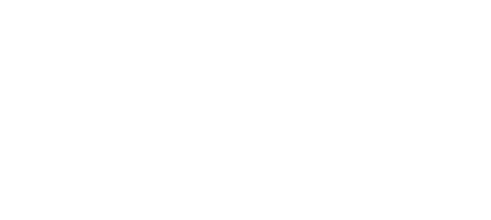

# PIVO AI Assistant

<p align="center">
  
</p>

<p align="center">
  
  
  
  
</p>

PIVO is an AI-assisted daily decision system for MSME food sellers. It turns sales logs into production recommendations, profit insights, and WhatsApp guidance, then exposes the same result in a mobile-first dashboard.

## Project Status

- `Status`: PoC
- `Goal`: Validate end-to-end reliability from data ingestion to owner-facing recommendation delivery
- `Current delivery`: Nightly backend pipeline + Next.js dashboard workspace + replay mode for demos

## Repository Structure

- `backend-ai/`: Python pipeline (ingestion, cleaning, forecasting, confidence tiering, LLM message generation, delivery, scheduler)
- `client-pivo/`: Next.js owner dashboard (`/u/:ownerId`) and supply simulator
- `contracts/payload_schema.json`: Shared JSON contract consumed by backend and frontend

## End-to-End Flow

1. Sales data is read from Google Sheets (or CSV in dev mode).
2. Data is cleaned, normalized, and validated.
3. Active SKUs are forecasted (Prophet first, ARIMA fallback).
4. Confidence tiers (`green`, `yellow`, `red`) are assigned per SKU.
5. Profit and anomaly insights are computed.
6. A Fig2-aligned payload is generated and validated against JSON schema.
7. WhatsApp message text is generated (Gemini) and sent (Fonnte).
8. Daily payload is stored in Supabase and fetched by the Next.js dashboard.

## Quick Start

### 1) Backend (`backend-ai`)

```bash
cd backend-ai
python -m venv .venv
# Windows
.venv\Scripts\activate
# macOS/Linux
# source .venv/bin/activate

pip install -r requirements.txt
copy .env.example .env
```

Set required env values in `.env`:

- `SUPABASE_URL`
- `SUPABASE_SERVICE_KEY`
- `GEMINI_API_KEY`
- `FONNTE_TOKEN`
- Optional for Sheets mode: `GOOGLE_SA_JSON_PATH`

Run one local cycle with CSV:

```bash
python -m app.pipeline --csv data/Serayu_Chicken_60k.csv
```

Run replay demo mode:

```bash
python -m app.pipeline --csv data/Serayu_Chicken_60k.csv --replay-mode --run-date 2026-01-11
```

Start nightly scheduler locally:

```bash
python scheduler.py
```

### 2) Frontend (`client-pivo`)

```bash
cd client-pivo
npm install
npm run dev
```

Create `client-pivo/.env.local` if you want live Supabase reads:

```bash
NEXT_PUBLIC_SUPABASE_URL=https://your-project.supabase.co
NEXT_PUBLIC_SUPABASE_ANON_KEY=your-anon-key
```

Open:

- `http://localhost:3000`
- Demo workspace: `http://localhost:3000/u/demo`
- Simulator: `http://localhost:3000/u/demo/simulator`

## Payload Contract

- Source: [`contracts/payload_schema.json`](contracts/payload_schema.json)
- Core fields: `owner_id`, `date`, `confidence_tier`, `forecasts`, `profit_analysis`, `wa_message`, `pwa_url`

## PoC Notes

- Backend is designed for per-owner failure isolation (`run_all_owners()` continues on errors).
- `FONNTE_DRY_RUN=true` is recommended for local tests.
- Frontend falls back to demo payload when Supabase is unavailable.
- Replay mode supports scenarios: `normal`, `missing_input`, `spike`, `drop`.

## Supporting Docs

- Backend flow notes: [`backend-ai/docs/DATA_FLOW.md`](backend-ai/docs/DATA_FLOW.md)
- Backend detail: [`backend-ai/BE-README.md`](backend-ai/BE-README.md)
- Frontend baseline notes: [`client-pivo/README.md`](client-pivo/README.md)


